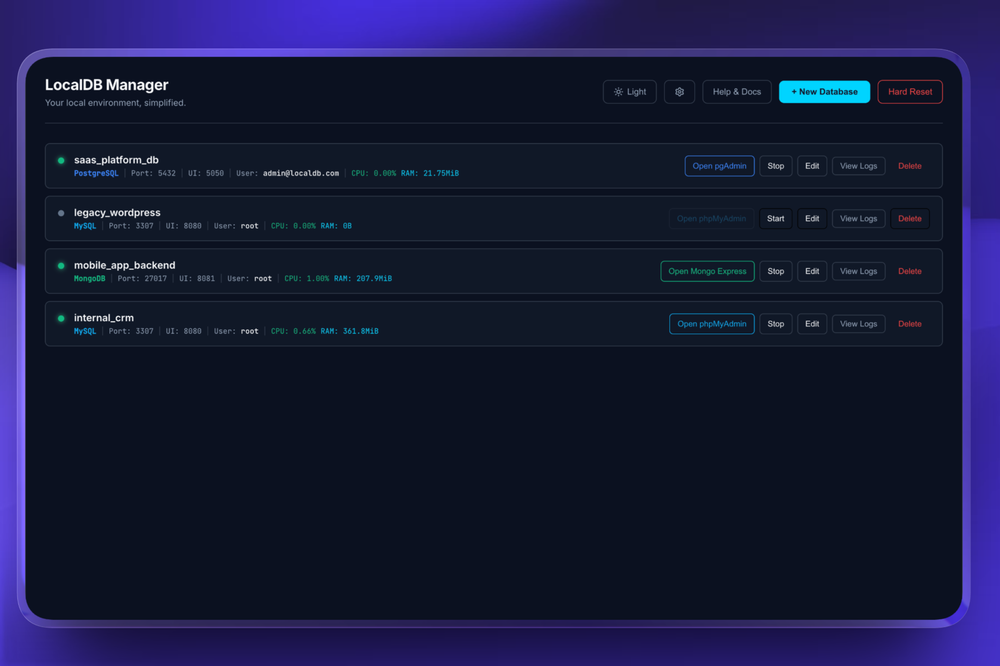
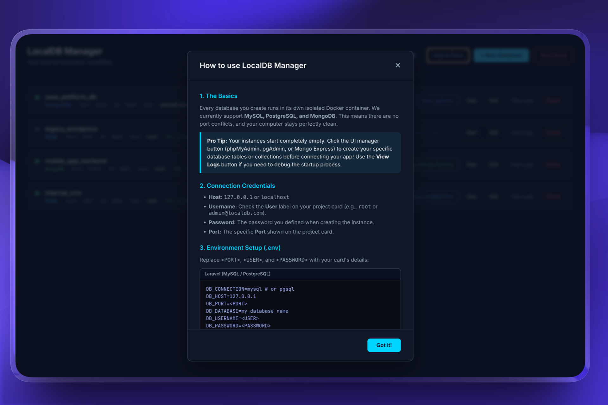
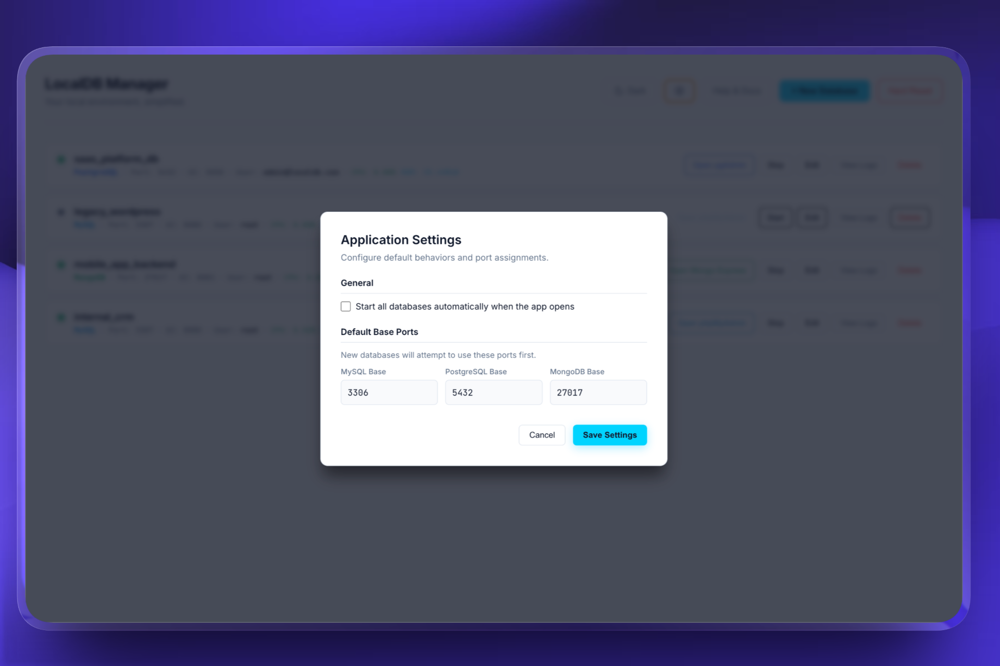

# 🗄️ LocalDB Manager

**LocalDB Manager** is a lightweight, cross-platform desktop application designed to simplify local database management for developers. 

Say goodbye to `"port 3306 is already in use"` errors. LocalDB Manager spins up isolated database instances using Docker, ensuring zero port conflicts and keeping your host machine completely clean.

---

## 📸 Screenshots

*Managing multiple database engines simultaneously with real-time CPU and RAM metrics.*

*Built-in framework connection snippets (Laravel, Next.js, TypeORM) ready to copy and paste.*

*Light mode interface featuring customizable default port ranges and auto-start settings.*

---

## ✨ Features

- 🚀 **Isolated Environments:** Every project runs in its own dedicated Docker container.
- 🔌 **Smart Port Management:** Automatic local port allocation to prevent overlapping conflicts.
- 📋 **Framework Ready:** Built-in `.env` connection snippets for frameworks like **Laravel, Next.js, and NestJS**.
- 🐳 **Engine Compatibility:** Works seamlessly with both **Docker Desktop** and **OrbStack** (macOS).
- 🗃️ **Integrated Tools:** One-click access to the correct UI managers (phpMyAdmin, pgAdmin, and Mongo Express).
- 🌙 **Modern UI:** Clean, Dark/Light native interface built with React and Electron.
- 📊 **Real-Time Metrics:** Monitor container CPU and RAM usage directly from your project cards.
- ⚙️ **System Tray:** Close the app to the menu bar and run it smoothly in the background for quick access.

---

## 📦 Installation

You don't need to build the app from source to use it. You can download the latest compiled version for your operating system:

1. Go to the [Releases](../../releases) page.
2. Download the appropriate installer for your system:
   - 🍎 **macOS:** Download the `.dmg` file.
   - 🪟 **Windows:** Download the `.exe` file.
   - 🐧 **Linux:** Download the `.AppImage` file.

> **⚠️ Important Requirement:** You must have **[Docker Desktop](https://www.docker.com/products/docker-desktop/)** or **[OrbStack](https://orbstack.dev/)** installed and running on your machine before opening the application.

---

## 💻 Tech Stack

- **Frontend:** React, React DOM, Web Vitals, Lucide React
- **Backend/Desktop Environment:** Electron, Node.js
- **Containerization:** Docker
- **Build Tools:** Electron Builder, Concurrently

---

## 📝 License

This project is licensed under the MIT License. See the [LICENSE](LICENSE) file for details.